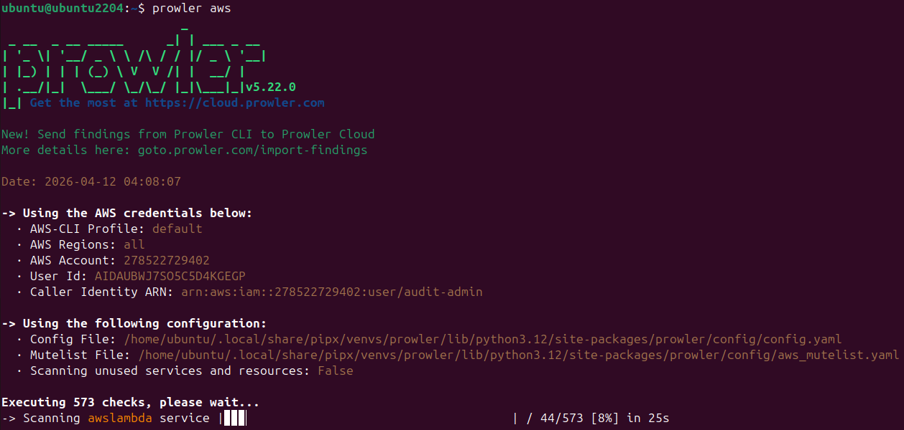
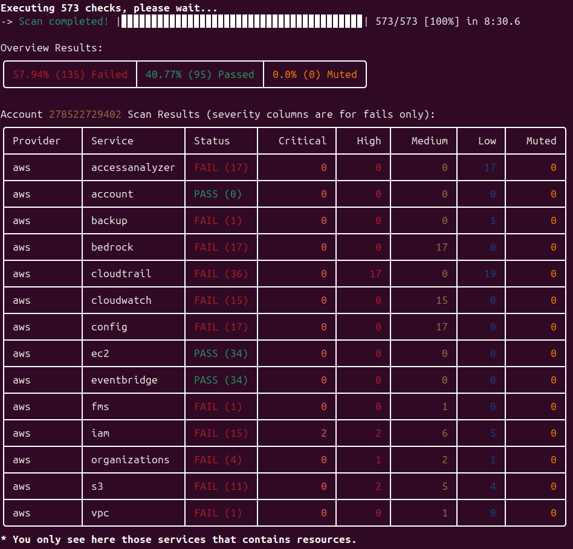

# AWS Cloud Security Audit Lab

## Project Overview
This repository contains the documentation, methodology, and evidence for a simulated Cloud Security Audit within an Amazon Web Services (AWS) environment. The primary objective is to demonstrate the practical identification, analysis, and remediation of common cloud misconfigurations using industry-standard auditing tools.

## Objectives
* Simulate a realistic cloud infrastructure with intentional vulnerabilities (e.g., public S3 buckets).
* Execute automated security assessments using **Prowler**.
* Analyze findings based on the **CIS Foundations Benchmarks for AWS**.
* Provide actionable remediation strategies to harden the infrastructure.

## Repository Structure
* `/reports` - Contains the final executive Audit Report detailing technical findings and business impact.
* `/logs` - Archives the raw, detailed HTML output generated by the Prowler scan.
* `/img` - Visual evidence of the lab setup, vulnerabilities, and remediation steps.

---

## Audit Methodology

The audit follows a structured, four-phase approach aligned with standard IT-Consulting practices:

### 1. Preparation & Honeypot Setup
A deliberately vulnerable AWS environment was created to simulate a critical cloud misconfiguration. An Amazon S3 bucket was provisioned with the "Block all public access" feature explicitly disabled.

  
   
  <em>Fig 1: Intentional misconfiguration disabling 'Block all public access' on the S3 bucket.</em>

To demonstrate the business impact, a file containing simulated Personally Identifiable Information (PII) and credentials was uploaded. This object was accessible via the public internet without any authentication requirements.

  
   
  <em>Fig 2: Unauthenticated internet access to the exposed dummy data.</em>

### 2. Audit Setup (Least Privilege)
To conduct the automated assessment securely, a dedicated IAM user (`audit-admin`) was created. Following the principle of least privilege, only the AWS-managed `SecurityAudit` policy was attached. This allowed the auditing tool read-only access to security configuration metadata without compromising the environment or allowing modifications.

  
   
  <em>Fig 3: Applying the principle of least privilege for the auditing entity.</em>

### 3. Execution & Findings
The automated assessment was executed via the AWS CLI using Prowler. The scan evaluated the account against multiple compliance frameworks, predominantly focusing on the CIS AWS Foundations Benchmark.

  
   
  <em>Fig 4: Execution of the Prowler audit tool via AWS CLI, displaying the scan summary.</em>

The scan successfully flagged the deliberately exposed S3 bucket among other default baseline misconfigurations. A detailed breakdown of the critical findings is documented in the final executive report located in `/reports/audit_report_v1.md`. 

*(Note: The full raw HTML report generated by Prowler is archived in the `/logs/prowler-full-scan-report.html` directory for forensic reference).*

### 4. Remediation
Following the identification of the critical vulnerability, immediate remediation steps were taken to secure the environment. The S3 bucket's permissions were modified to enforce strict access controls, effectively mitigating the risk of unauthorized data exposure.

  
   
  <em>Fig 5: Successful remediation enforcing strict public access blocking on the affected resource.</em>

---
> **Disclaimer:** This project is strictly for educational purposes and was conducted in a controlled, isolated environment. All vulnerable resources were permanently secured or deleted after the conclusion of the audit.
