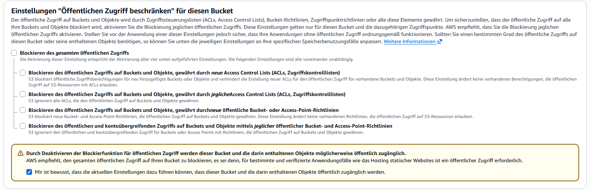
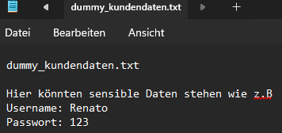
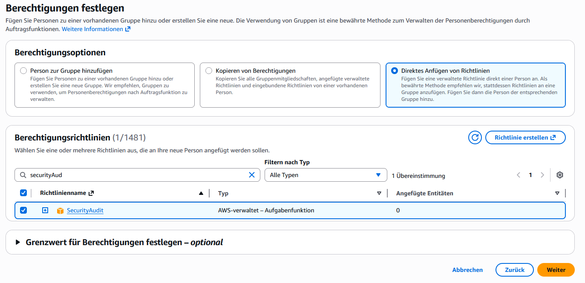

# ☁️ AWS Cloud Security Audit Lab

This repository contains documentation and scripts for a simulated Cloud Security Audit on an AWS environment.

## Project Overview
The goal is to demonstrate the identification and remediation of common cloud misconfigurations (e.g., exposed S3 buckets) using industry-standard tools like Prowler.

## 🔍 Audit Methodology
The audit will follow a structured approach based on the CIS Foundations Benchmarks for AWS:
1. **Preparation:** Setting up a deliberately vulnerable AWS environment (e.g., public S3 bucket).
2. **Execution:** Running automated security scans using `prowler`.
3. **Analysis:** Reviewing findings and determining business impact.
4. **Remediation:** Implementing the necessary security controls to harden the environment.

### 1. Preparation & Honeypot Setup
A deliberately vulnerable AWS environment was created to simulate a common cloud misconfiguration. An S3 bucket was provisioned with the "Block all public access" feature explicitly disabled.

To demonstrate the business impact, a file containing dummy PII/Credentials was uploaded to the exposed bucket.

### 2. Audit Execution (Least Privilege)
To conduct the automated assessment securely, a dedicated IAM user (`audit-admin`) was created. Following the principle of least privilege, only the AWS-managed `SecurityAudit` policy was attached, allowing read-only access to security configuration metadata without compromising the environment.

*(Further steps: Scanning with Prowler and Analysis - in progress)*
